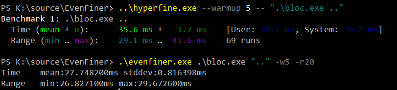

# EvenFiner

Work in progress.

Based on [hyperfine](https://github.com/sharkdp/hyperfine) but starts process directly bypassing the overhead of process creation and CONHOST.

Removes few ms from mean and significantly reduces stddev by using win32 CreateProcess instead of system() bypassing CONHOST 
and starting the timer after the process has been created.
 
See 

